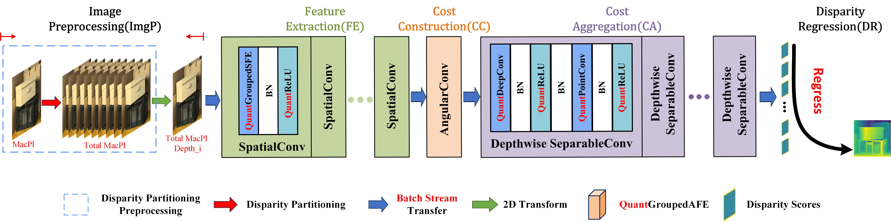
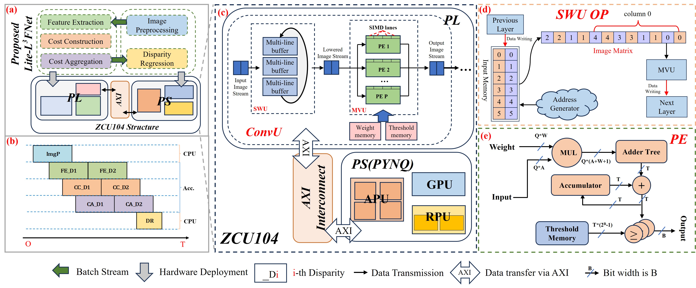

# RE-LFDE
RE-LFDE: A Resource-Efficient Hardware Accelerator for Low-bit Light Field Image Depth Estimation



## Software Preparation

### Requirement

- PyTorch 1.3.0, torchvision 0.4.1. The code is tested with python=3.8, cuda=11.0.
- A GPU with enough memory

### Datasets

- We used the HCI 4D LF benchmark for training and evaluation. Please refer to the [benchmark website](https://lightfield-analysis.uni-konstanz.de/) for details.

### Path structure

- ./dataset  
  - training  
  Location of the training data.  
  - validation  
  Verify where the data is stored.
- ./Figure  
  - paper_picture  
  Images from the paper.  
  - hardware_picture  
  Hardware design picture.
- ./Hardware  
A file containing a series of hardware for the RE-LFDE and ablation experimental groups.  
  - RE-LFDE  
    It contains the bit files and the hwh files for hardware, and the project code for PYNQ implementation.  
  - Net_Lp  
    Contains the bit files and the hwh files for hardware.
  - Net_Op  
    Contains the bit files and the hwh files for hardware.  
  - Net_w2bit  
    Contains the bit files and the hwh files for hardware.  
  - Net_w8bit  
    Contains the bit files and the hwh files for hardware.  
- ./implement  
RE-LFDE implementation files and data preprocessing file on Pytorch.
- ./jupyter  
Network execution scripts, as well as some algorithm implementation scripts.
- ./log  
Log files that record the accuracy of each verification scenario during verification.
- ./loss  
loss Drop image, recording the loss for each validation.
- ./model  
Network and regular functions to call.
- ./param  
The checkpoint of the networks is stored here.

- ./Results  
Store network test results, pfm files and converted png files.  
  - our network  
    - Net_Full  
    - Net_Quant  
  - Necessity analysis  
    - Net_None  
    - Net_77  
    - Net_DPP  
  - Performance improvement analysis
    - Net_Lp  
    - Net_w2bit  
    - Net_w8bit  
    - Net_Op  

### Train

- Set the hyper-parameters in parse_args() if needed. We have provided our default settings in the realeased codes.
- You can train the network by calling implement.py and giving the mode attribute to train.  
    ``` python ./implement/implement.py --net Net_Full  --n_epochs 3000 --mode train --device cuda:0 ```

- Checkpoint will be saved to ./param/'NetName'.
  
### Valition and Test

- After loading the weight file used by your domain, you can call implement.py and giving the mode attribute to valid or test.
- The result files (i.e., scene_name.pfm) will be saved to ./Results/'NetName'.

### Results

#### Contrast with the state-of-the-art work


## Hardware Preparation

### Hardware Requirement

- ZCU104 platform
- A memory card with PYNQ installed.  
  For details on the initialization of PYNQ on ZCU104, please refer to the Chinese version of the blog "[PYNQ](https://blog.csdn.net/m0_52279000/article/details/129396434?spm=1001.2014.3001.5501)".
- Vivado Tool Kit (vivado, HLS, etc.)
- An Ubuntu with more than 16GB of memory (the Vivado tool is faster when used in Ubuntu)


### Hardware overall


### Hardware Schematic Diagram
See ```'./Figure/hardware_picture/top.pdf' ```

### Hardware Resource Consump


# Citiation
If you find this work helpful, please consider citing:  
Our paper is currently under submission
<!-- ``` cite
@Article{L3FNet,
    author    = {Jie Li, Chuanlun Zhang, Wenxuan Yang, Heng Li, Xiaoyan Wang, Yiguang Liu},
    title     = {FPGA-based Low-bit and Low-power Fast LF Image depth estimation},
    journal   = {}, 
    year      = {2023},   
}
``` -->

# Contact
Welcome to raise issues or email to Chuanlun Zhang(specialzhangsan@gmail.com or zcl_20000718@163.com) for any question regarding this work
