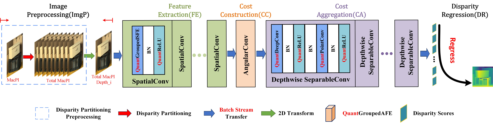
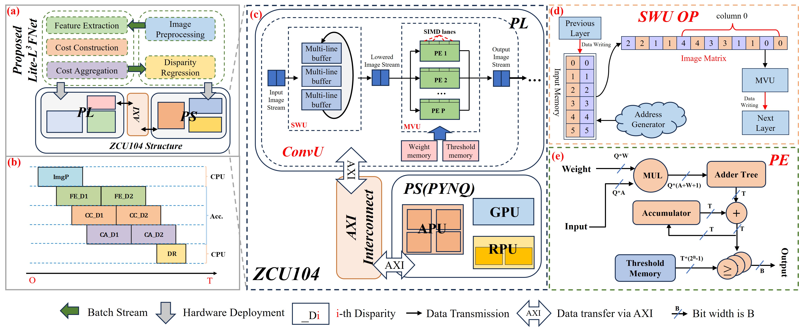

# RE-LFDE
RE-LFDE: A Resource-Efficient Hardware Accelerator for Low-bit Light Field Image Depth Estimation



## Software Preparation

### Requirement

- PyTorch 1.3.0, torchvision 0.4.1. The code is tested with python=3.8, cuda=11.0.
- A GPU with enough memory

### Datasets

- We used the HCI 4D LF benchmark for training and evaluation. Please refer to the [benchmark website](https://lightfield-analysis.uni-konstanz.de/) for details.

### Path structure
```
.
├── dataset
│   ├── training                 # Location of the training data
│   └── validation               # Location of the validation data
│
├── Figure
│   ├── paper_picture            # Images used in the paper
│   └── hardware_picture         # Hardware design images
│
├── Hardware
│   ├── RE-LFDE                  # RE-LFDE hardware files and PYNQ project code
│   │   ├── *.bit                # Bitstream files
│   │   ├── *.hwh                # Hardware handoff files
│   │   └── pynq_project         # PYNQ implementation project
│   │
│   ├── Net_Lp                   # Ablation experiment hardware files
│   │
│   ├── Net_Op
│   │
│   ├── Net_w2bit
│   │
│   └── Net_w8bit
│
├── implement                    # RE-LFDE implementation and preprocessing files (PyTorch)
│
├── model                        # Network definitions and utility functions
│
├── param                        # Network checkpoints
│
└── Results
    ├── our_network
    │   ├── Net_Full
    │   └── Net_Quant
    │
    ├── Necessity_analysis
    │   ├── Net_None
    │   ├── Net_77
    │   └── Net_DPP
    │
    └── Performance_improvement_analysis
        ├── Net_Lp
        ├── Net_w2bit
        ├── Net_w8bit
        └── Net_Op
```
### Train

- Set the hyper-parameters in parse_args() if needed. We have provided our default settings in the realeased codes.
- You can train the network by calling implement.py and giving the mode attribute to train.  
    ``` python ./implement/implement.py --net Net_Full  --n_epochs 3000 --mode train --device cuda:0 ```

- Checkpoint will be saved to ```./param/'NetName'```.
  
### Valition and Test

- After loading the weight file used by your domain, you can call implement.py and giving the mode attribute to valid or test.
- The result files (i.e., scene_name.pfm) will be saved to ./Results/'NetName'.

### Results

#### Contrast with the state-of-the-art work


## Hardware Preparation

### Hardware Requirement

- ZCU104 platform
- A memory card with PYNQ installed.  
  For details on the initialization of PYNQ on ZCU104, please refer to the Chinese version of the blog "[PYNQ](https://blog.csdn.net/m0_52279000/article/details/129396434?spm=1001.2014.3001.5501)".
- Vivado Tool Kit (vivado, HLS, etc.)
- An Ubuntu with more than 16GB of memory (the Vivado tool is faster when used in Ubuntu)


### Hardware overall


<!-- ```
### Hardware Schematic Diagram
See ```'./Figure/hardware_picture/top.pdf' ```

### Hardware Resource Consump
``` -->

# Citiation
If you find this work helpful, please consider citing:  
Our paper is currently under submission
``` cite
@Article{10.1145/3807499,
author = {Li, Jie and Zhang, Chuanlun and Li, Heng and Du, Shuangli and Yang, Wenxuan and Wang, Xiaoyan and Liu, Yiguang},
title = {RE-LFDE: A Resource-Efficient Hardware Accelerator for Low-Bit Light Field Image Depth Estimation},
year = {2026},
issue_date = {May 2026},
publisher = {Association for Computing Machinery},
address = {New York, NY, USA},
volume = {25},
number = {3},
issn = {1539-9087},
url = {https://doi.org/10.1145/3807499},
doi = {10.1145/3807499},
month = may,
articleno = {43},
numpages = {20},
keywords = {Light field, depth estimation, FPGA, low-bit, lightweight}
}
```

# Contact
Welcome to raise issues or email to Chuanlun Zhang(specialzhangsan@gmail.com or zcl_20000718@163.com) for any question regarding this work
